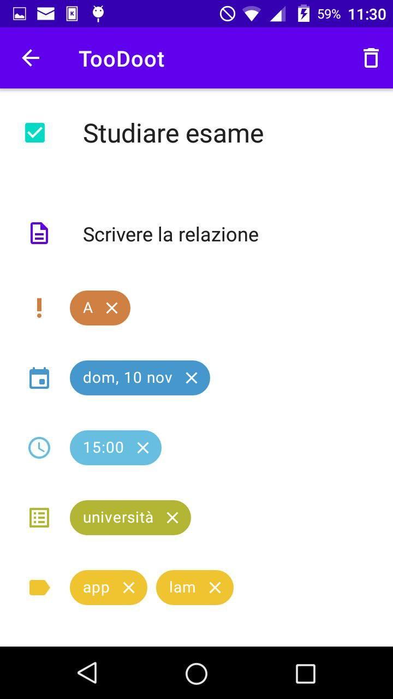
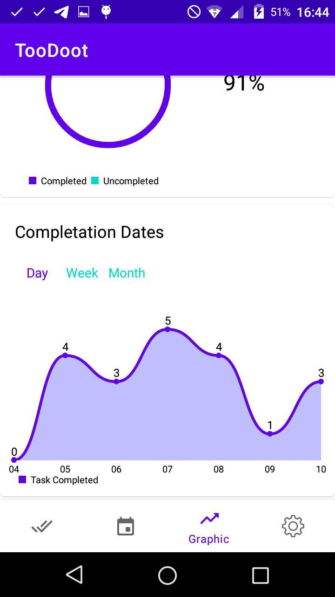

# Funzionalità dell'applicazione

+ Creazione e modifica delle attività
+ Visualizzazione del calendario con relativa lista delle attività giornaliere
+ Visualizzazione dei grafici con percentuale e numero delle attività completate
+ Ricerca e filtraggio delle attività
+ Notifiche giornaliere per ogni attività da svolgere
+ Caricamento di file todo.txt

# todo.txt

L'applicazione si interfaccia a un file di testo formato `todo.txt`

+ Facilmente leggibile e modificabile
+ Possibile la sincronizzazione su più dispositivi
+ Semplice
+ Leggero

# Attività

:::::::::::::: {.columns}
::: {.column width="70%"}

+ **Nome:** Titolo dell'attività
+ **Stato:** Tiene conto se l'attività è completata o meno
+ **Descrizione:** Informazioni aggiuntive sull'attività
+ **Priorità:** Importanza dell'attività, è associata una priorità ad ogni lettera dalla A (priorità alta) alla Z (priorità bassa)
+ **Data:** Giorno in cui deve essere svolta l'attività
+ **Ora:** Ora in cui deve essere svolta l'attività
+ **Liste (o contesti):** Corrisponde al posto o alla situazione in cui viene svolta l'attività
+ **Tag:** Qualunque tipo di parola chiave relativa all'attività

:::

::: {.column width="30%"}

::: 
:::::::::::::: 

# La classe Task

+ Effettua il parsing del task in formato `todo.txt`
+ Scrive e legge il file
+ Contiene i campi dell'attività e i relativi metodi
+ Contiene dei metodi statici che hanno a che fare con la totalità dei task

# MainActivity 
:::::::::::::: {.columns}
::: {.column width="70%"}

Comprende:

+ **Toolbar:** viene mostrato il nome dell'applicazione e l'icona di ricerca
+ **Container:** viene riempito dai vari fragment 
+ **BottomNavigationMenu:** seleziona i fragment da visualizzare 

:::
::: {.column width="30%"}

::: 
:::::::::::::: 

# TodoFragment 

:::::::::::::: {.columns}
::: {.column width="70%"}

Questa schermata mostra l'elenco di tutte le attività, che vengono ordinate in base a

+ **Stato**
+ **Data**
+ **Priorità**
+ **Creazione**

In questa schermata è anche possibile aggiungere le attività
:::
::: {.column width="30%"}

::: 
:::::::::::::: 

# Swipe

+ **Swipe a destra:** viene segnata l'attività come completata
+ **Swipe a sinistra:** viene posticipata l'attività (il valore è determinato da un dialog)

:::::::::::::: {.columns}
::: {.column width="30%"}

{width="90%"}

:::
::: {.column width="30%"}

{width="90%"}

:::
::: {.column width="30%"}

{width=90%}

:::
::::::::::::::

# Ricerca

:::::::::::::: {.columns}
::: {.column width="70%"}

La ricerca viene eseguita direttamente sul file, quindi su tutti i campi dell'attività. Alla stringa di ricerca vengono estratte le parole che la compongono e poi per ogni linea di file si vede se queste parole sono contenute all'interno

:::
::: {.column width="30%"}

::: 
::::::::::::::
# AddTaskFragment 

:::::::::::::: {.columns}
::: {.column width="70%"}

Questo fragment è un dialog che permette di aggiungere un nuovo task, contiene:

+ **EditText:** Dove viene assegnato il nome dell'attività
+ **ChipGroup:** Contiene i campi inseriti
+ **Pulsanti:** Ciascuno relativo a un campo dell'attività, ogni pulsante mostrerà un dialog per l'aggiunta di un particolare campo

:::
::: {.column width="30%"}

:::
::::::::::::::

# CalendarFragment

Il `CalendarFragment` contiene: 

+ TodoFragment
+ Calendario espandibile

:::::::::::::: {.columns}
::: {.column width="40%"}

{width=80%}
:::
::: {.column width="40%"}

{width=80%}

:::
::::::::::::::

# GraphicFragment

Vengono mostrati due tipi di grafici:

+ Grafico a torta
+ Grafico a linee
 
È possibile selezionare una lista o un tag in modo da avere le statistiche solo per un determinato tipo di attività

# Grafico a torta
:::::::::::::: {.columns}
::: {.column width="70%"}

Mostra la percentuale delle attività completate, l'utente può decidere quali prendere in considerazione: 

+ Tutte
+ Giornaliere
+ Settimanali
+ Mensili

:::
::: {.column width="30%"}

:::
::::::::::::::

# Grafico a linee
:::::::::::::: {.columns}
::: {.column width="70%"}

Mostra il totale delle attività completate per intervallo temporale:

+ Giornaliero
+ Settimanale
+ Mensile

:::
::: {.column width="30%"}

:::
::::::::::::::

# PreferenceFragment 
:::::::::::::: {.columns}
::: {.column width="70%"}

La schermata delle impostazioni permette di modificare le preferenze dell'applicazione, è possibile:

+ Caricare un altro `todo.txt` presente nella memoria del dispositivo
+ Cambiare cartella del `todo.txt`, quindi spostarlo
+ Impostare la priorità minima per le notifiche
+ Modificare l'ora di ricevimento giornaliero delle notifiche
+ Nascondere dal `TodoFragment` i task completati

:::
::: {.column width="30%"}

:::
::::::::::::::

# EditTaskActivity

:::::::::::::: {.columns}
::: {.column width="70%"}

Questa activity consente di :

+ Mostrare i campi di un specifico task selezionato dall'utente
+ Modificare i campi con pulsante di aggiunta o chip
+ Rimuovere l'attività

:::
::: {.column width="30%"}

:::
::::::::::::::

# Dialog di modifica 

Quando si vuole inserire o modificare un nuovo campo viene mostrato il dialog relativo, sono quindi:

+ **Priorità:** Picker di lettere: la lettera selezionata sarà la priorità
+ **Data:** Date picker
+ **Ora:** Time picker
+ **Liste e Tag:** Ci sono due dialog separati ma identici 

:::::::::::::: {.columns}
::: {.column width="27%"}

{width=80%}

:::
::: {.column width="27%"}

{width=80%}

:::
::: {.column width="27%"}

{width=80%}

:::
::::::::::::::

# Dialog liste e tag

Questo dialog contiene 

+ **EditText:** permette di aggiungere nuove liste/tag
+ **Lista di liste o tag:** permette di selezionare tra le liste/tag già esistenti

:::::::::::::: {.columns}
::: {.column width="35%"}

{width=80%}

:::
::: {.column width="35%"}

{width=80%}

:::
::::::::::::::

# Notifiche

:::::::::::::: {.columns}
::: {.column width="40%"}

:::
::::::::::::::

Ogni giorno, a un orario impostabile dall'utente, e dopo ogni boot l'applicazione invia per ogni attività da completare nella giornata una notifica.

La gestione delle notifiche è delegata a due componenti 

+ **`AlarmReceiver`:** è un'estensione del `BroadcastReceiver` che  al boot, o quando viene ricevuto l'intent impostato dall'`AlarmManager`, chiama il `NotificationScheduler` per  mostare le notifiche.
+ **`NotificationScheduler`:** si occupa di mostrare le notifiche, ma anche di impostare o cancellare i reminder dell'`AlarmManager`

# Possibili aggiunte future

+ Più lingue disponibili
+ Attività selezionabili direttamente dalla lista, per poter eseguire la stessa operazione su attività diverse
+ Schermata Todo personalizzabile con intervallo temporale personalizzabile
+ Aggiungere coppie chiave valore di qualsiasi tipo
