---

title: 
    - TooDoot

subtitle: 
    - An elegant todo.txt app

author:
    - Stefano Bucciarelli

---

# Funzionalità dell'applicazione

+ Creazione, modifica e rimozione delle attività
+ Personalizzazione dell'attività con aggiunta di descrizione, priorità, data, ora, liste e tag
+ Visualizzazione del calendario con relativa lista delle attività giornaliere
+ Visualizzazione dei grafici con percentuale e numero delle attività completate, con possibilità di selezione di data, liste e tag
+ Ricerca e filtraggio delle attività
+ Notifiche giornaliere per ogni attività da svolgere
+ Impostazione di priorità minima delle attività da visualizzare e di cui essere noticati
+ Salvataggio automatico dei task nel formato todo.txt
+ Caricamento di file todo.txt

# todo.txt

L'applicazione non fa altro che interfacciarsi a un file di testo formato `todo.txt`, che ha principalmente il vantaggio di essere facilmente leggibile e di essere comodo per l'utente il quale può leggerlo e modificarlo con un semplice file di testo (vedi: [todo.txt format](https://github.com/todotxt/todo.txt)). Inoltre in questo modo è anche facile la sincronizzazione su più dispositivi, perché si tratta solo di sincronizzare dei file di testo.


# Componenti

## Attività

Le attività o task sono il componente principale dell'applicazione, ed è formata dalle seguenti proprietà:

+ **Nome:** Titolo dell'attività
+ **Stato:** Tiene conto se l'attività é completata o meno
+ **Descrizione:** Informazioni aggiuntive sull'attività
+ **Priorità:** Importanza dell'attività, è associata una priorità ad ogni lettera dalla A (priorità alta) alla Z (priorità bassa)
+ **Data:** Giorno in cui deve essere svolta l'attività
+ **Tempo:** Ora in cui deve essere svolta l'attività
+ **Liste (o contesti):** Corrisponde al posto o alla situazione in cui viene svolta l'attività
+ **Tag:** Qualunque tipo di tag relativo all'attività

Tutte queste proprietà (a parte lo stato) possono essere nulle

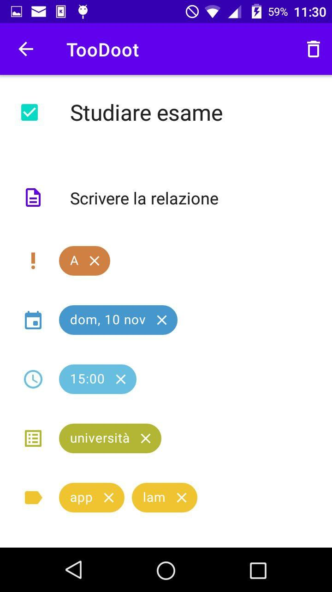{width=30% height=10%}


## Liste e Tag

Le liste e i tag sono gestiti come stringhe, liberamente eliminabili e aggiungibili nell'attività. Ogni attività avrà zero o più liste o zero o più tag a seconda di quello che selezionerà l'utente. A livello implementativo non c'è differenza tra liste e tag (se non che sono separati) quindi spetterà all'utente scegliere come utilizzarli per l'uno o per l'altro tipo; ma si consiglia di utilizzare le liste come contesti in cui viene realizzata l'attività, mentre i tag come qualsiasi tipo di parole chiave ad essa associate.

## Notifiche

L'applicazione permette di ricevere notifiche relative alle attività, infatti ad ogni notifica è associato un'attività che deve essere ancora completata. Nelle impostazioni l'utente può selezionare l'orario di arrivo delle notifiche, e ogni giorno a quell'ora gli verranno inviate le notifiche di tutte le attività non ancora completate previste per quella giornata. Le notifiche vengono, poi, inviate quando si fa il boot del dispositivo. Inoltre l'utente può impostare una priorità minima per cui un'attività venga notificata. 

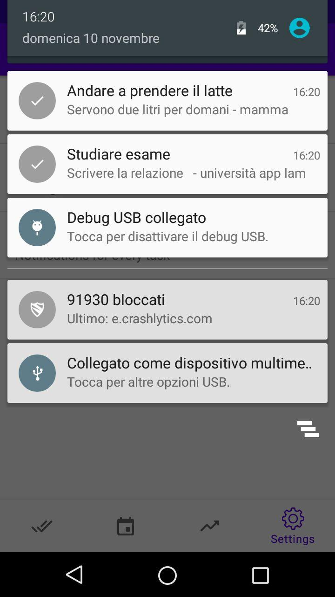{width=30% height=10%}


# Schermate

Graficamente l'applicazione è gestita da quattro schermate (lista delle attività, calendario, grafici e impostazioni) selezionabili da un bottom menu, più una schermata (modifica attività) che viene aperta quando viene cliccata un'attività della lista

## Lista delle attività

Questa schermata mostra l'elenco di tutte le attività, e per ogni attività vengono mostrate tutte le sue proprietà (a parte la descrizione). 

L'ordine della attività é determinato dalle seguenti proprietà:

+ Vengono visualizzati le attività non completate e prima di quelle completate
+ A parità di stato vengono visualizzate in ordine crescente di data e ora
+ Se due attività hanno anche la stessa data e ora allora viene visualizzate in ordine decrescente di priorità
+ Qualora tra due attività tutti i parametri precedenti dovessero essere uguali vengono mostrati in ordine descrescente di creazione

Nella schermata ad ogni singola attività è stata aggiunto lo swipe:

+ Swipe a destra: viene segnata l'attività come completata
+ Swipe a sinistra: viene posticipata l'attività (il valore è determinato da un dialog)

In questa schermata è anche possibile aggiungere le attività
È possibile filtrare le attività tramite la ricerca, che oltre al nome dell'attività cercherà tutti i vari campi


{width=30% height=10%}

{width=30% height=10%}

{width=30% height=10%}


## Calendario

La schermata a calendario consente di selezionare una data in modo da mostrare l'elenco delle attività previste per quella determinata data, esattamente come è mostrato nella lista delle attività. Alla data sul calendario non sempre corrisponde la data dell'attività infatti quest'ultima potrebbe non essere specificata: in questo caso come data dell'attività verrà considerata la data di completamento, se anche quest'ultima non è specificata (basta che l'attività non sia completata) viene considerata come data dell'attività la data del giorno attuale.


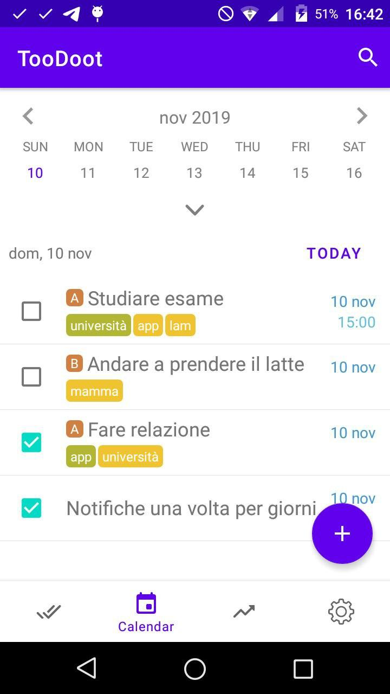{width=30% height=10%}


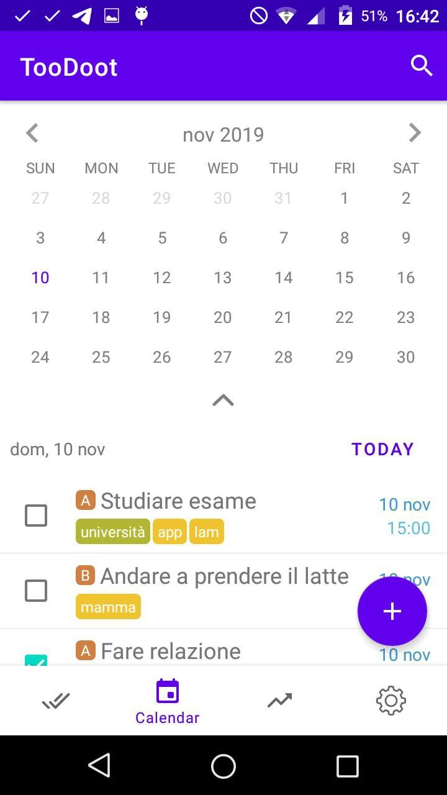{width=30% height=10%}


## Grafici

In questa schermata vengono mostrati due tipi di grafici: il diagramma a torta e il diagramma a linee. È possibile selezionare una lista o un tag in modo da avere le specifiche solo per un determinato tipo di attività

### Grafico a torta

In questo grafico viene mostrata la percentuale dei task completati rispetto ai task ancora da completare. È possibile selezionare un intervallo di tempo, per decidere quali attività prendere in considerazione:

+ Tutte
+ Giornaliere
+ Settimanali
+ Mensili

### Grafico a linee

A differenza del grafico precedente prende in considerazione solo le attività completate, queste verranno sommate in modo da avere un totale per l'intervallo di tempo specificato, che può essere:

+ Giornaliero
+ Settimanale
+ Mensile


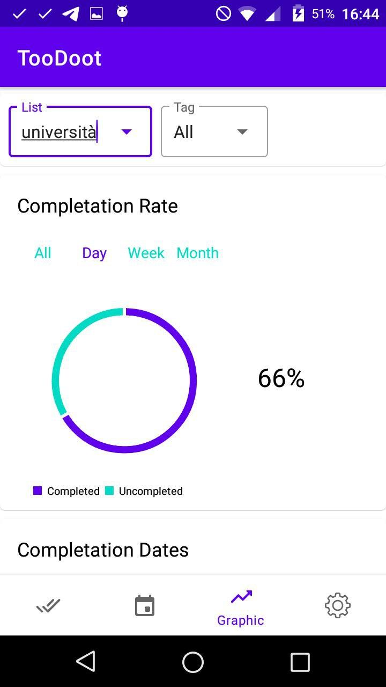{width=30% height=10%}


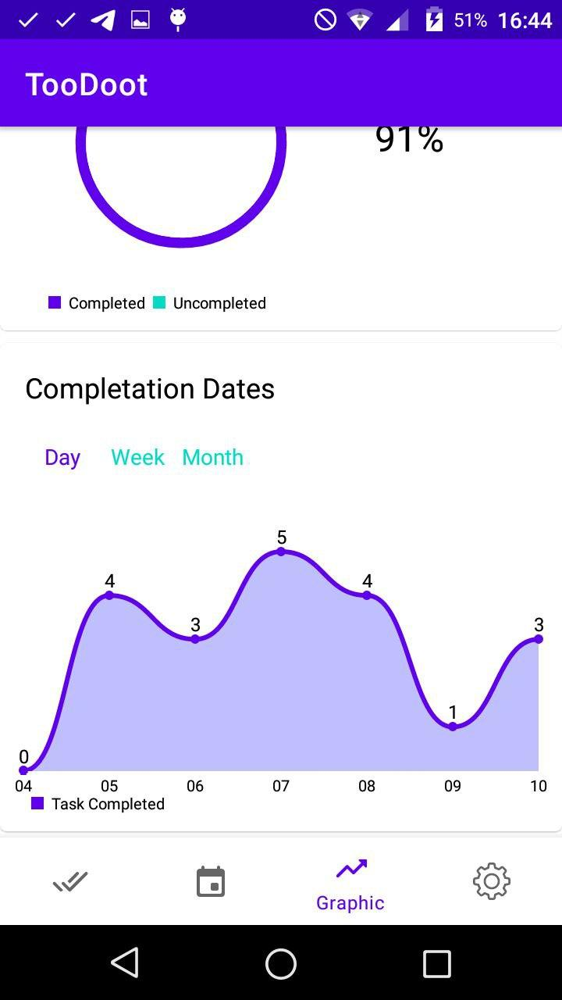{width=30% height=10%}


## Impostazioni

La schermata delle impostazioni permette di modificare le preferenze dell'applicazione, è possibile:

+ Caricare un altro `todo.txt` presente nella memoria del dispositivo
+ Cambiare cartella del `todo.txt`, quindi spostare quest'ultimo
+ Impostare la priorità minima per le notifiche 
+ Modificare l'ora di ricevimento giornaliero delle notifiche

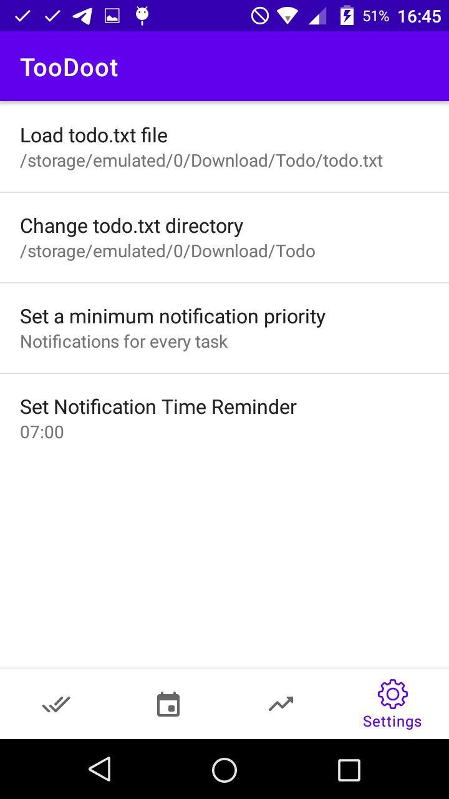{width=30% height=10%}

## Modifica attività

In questa schermata è possibile modificare -quindi aggiungere, cambiare o rimuovere i campi- o rimuovere un'attività.

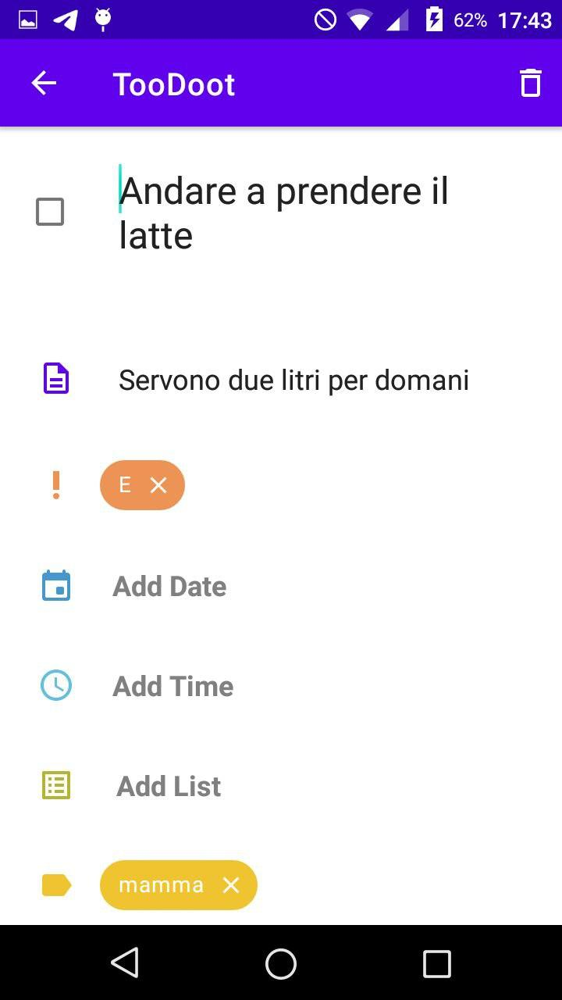{width=30% height=10%}

# Dialog

Ci sono diversi tipi di dialog che vanno in supporto alle varie schermate

## Aggiungi attività

In questo dialog è possibile aggiungere un nuovo task, specificando, oltre al nome, i relativi campi che si vuole inserire

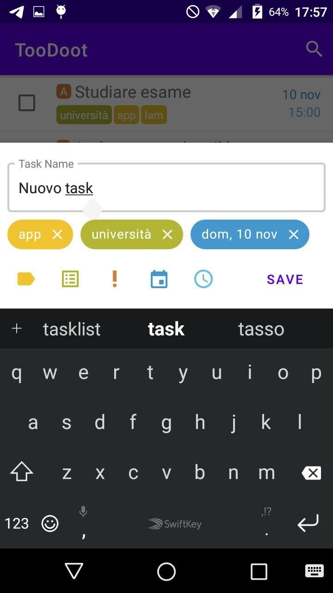{width=30% height=10%}

## Dialog di modifica

Quando si vuole inserire o modificare un nuovo campo viene mostrato il dialog relativo, sono quindi:

+ **Priorità:** Consiste in un picker di lettere: la lettera selezionata sarà la priorità
+ **Data:** Consiste in un date picker
+ **Ora:** Consiste in un time picker
+ **Liste e Tag:** Ci sono due dialog separati ma uguali, permettono di aggiungere nuove liste o tag, o di selezionarne tra quelli già esistenti

{width=30% height=10%}

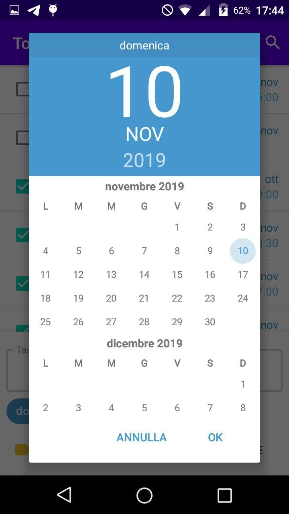{width=30% height=10%}

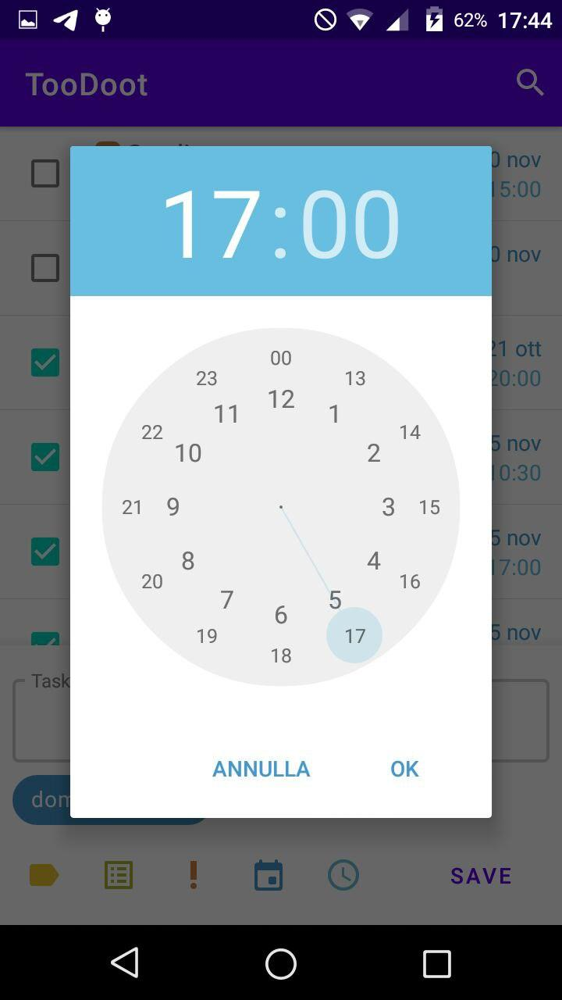{width=30% height=10%}

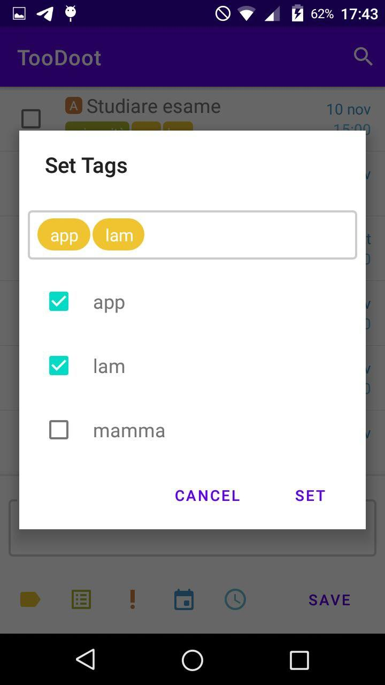{width=30% height=10%}

## Posticipa attività

Dopo lo swipe a sinistra nella lista delle attività viene mostrato questo dialog che permette all'utente di posticipare l'attività in una data a sua scelta

{width=30% height=10%}

# Implementazione

## Interfaccia utente

A livello implementativo l'interfaccia utente consiste in un'activity principale (`MainActivity`), contenente un bottom menu, la top bar con la ricerca e il container il quale viene riempito dai vari fragment (̀`TodoFragment`, `CalendarFragment`, `GraphicFragment` e `SettingFragment`) ogni volta che viene selezionato un'icona nel bottom menu.
```
@Override
public boolean onNavigationItemSelected(@NonNull MenuItem item) {

    switch (item.getItemId()) {
        case R.id.navigation_todo: {
            makeSearchVisible(true);
            fragment = new TodoFragment(
                Task.getSavedTasks(getApplicationContext()));
            todoFragment = (TodoFragment)fragment;
            break;
        }
        case R.id.navigation_calendar: {
            makeSearchVisible(true);
            fragment = new CalendarFragment();
            calendarFragment = (CalendarFragment)fragment;
            break;
        }
        case R.id.navigation_graphic: {
            makeSearchVisible(false);
            fragment = new GraphicFragment();
            break;
        }
        case R.id.navigation_settings: {
            makeSearchVisible(false);
            fragment = new PreferencesFragment(MainActivity.this);
            break;
        }
    }
    return loadFragment(fragment);
}
```

## Task

I task vengono creati dell'`AddTaskFragment`, modificati e eliminati nel `EditTaskActivity` e visualizzati nel `TodoFragment`. In quest'ultimo 
alla lista di attività è associata una `RecyclerView` che con il relativo `TaskAdapter`, che fornisce una view per ogni task. Ogni modifica da parte dell'utente alla lista di attività consiste in una chiamata al `TodoFragment` che chiama il suo `TaskAdapter` che esegue poi l'operazione sulla lista.

Tutti i task dell'applicazione sono salvati in un file, di conseguenza la lista delle attività viene prelevata dal file (specificato o non dall'utente). Quindi ad ogni operazione sulla lista (inserimento, modifica, o rimozione) deve corrispondere la stessa operazione nel file: l'utente si interfaccia col `TodoFragment`, quest'ultimo deve associare ad ogni operazione dell'utente la medesima operazione nella classe più interna `Task` che gestisce la modifica del file. 

La classe `Task` è la classe relativa ad ogni singola attività quindi contiene i campi dell'attività e i relativi metodi. In più contiene dei metodi statici che hanno a che fare con la totalità dei task, come quello che restituisce tutti i task nel file:

```
public static ArrayList<Task> getSavedTasks(Context context){
        ArrayList<Task> tasks = new ArrayList<Task>();
        File file = new File(
            Utils.getFilePath(
                PreferenceManager.getDefaultSharedPreferences(context)));
        try {
            Scanner scanner = new Scanner(file);
            while (scanner.hasNextLine()) {
                String line = scanner.nextLine();
                try{
                    tasks.add(new Task(line));
                }
                catch (ParseException e){
                    Toast.makeText(context, e.getMessage(), Toast.LENGTH_LONG)
                    .show();
                }
            }
        } catch(FileNotFoundException e) {
            Toast.makeText(context, "todo.txt non found", Toast.LENGTH_LONG)
            .show();
        }
        return tasks;
    }
```
Ovviamente sempre `Task` si deve preoccupare di fare il parsing della linea corrispondente nel file, all'oggetto `Task` vero e proprio.

## Calendario

Il `CalendarFragment` non è altro che un `TodoFragment` a cui viene aggiunta la view del calendario, qui la lista di attività viene cambiata non solo alla modifica, ma anche alla selezione della data sul calendario.

Il calendario è stato implementato utilizzando la funzione di libreria [CollapsibleCalendar](https://github.com/shrikanth7698/Collapsible-Calendar-View-Android) che fornisce un calendario espandibile. ## Grafici

## Grafici

I grafici sono  implementati usando la libreria [MPAndroidChart](https://github.com/PhilJay/MPAndroidChart), e per ciascuno dei due grefici sono presenti dei pulsanti che modificano il dataset, principalmente selezionando le attività la cui data rientra in un certo intervallo temporale.
Inoltre il dataset è modificabile selezionando tag o liste nei dropdown

## Preferenze

Le preferenze dell'applicazione sono gestite tramite `SharedPreferences`, quindi sono salvate mediante il modello chiave valore, le chiavi sono costanti e i valori vengono settati in questa schermata, per poi essere prelevati in un punto qualsiasi del programma.

In questa schermata è possibile selezionare un file che funga da `todo.txt` per l'applicazione, questa preferenza è implementata usando la libreria [android-file-chooser](https://github.com/hedzr/android-file-chooser)

## Activity di Modifica

Oltre a `MainActivity` è presente una seconda activity, ovvero `EditTaskActivity`. Questa activity mostra i campi di un specifico task selezionato dall'utente, e per ogni campo fornisce un pulsante di aggiunta -qualora il campo sia nullo- oppure una chip col valore del campo. Quindi questa classe si occupa di cambiare view (da `Button` a ̀`ChipGroup`) a run-time.

```
private void changeView(View from, View to){

    ViewGroup parent = (ViewGroup) from.getParent();
    int index = parent.indexOfChild(from);

    parent.removeView(from);
    parent.addView(to, index);

}
```

## Dialog

I dialog estendono tutti la classe `Dialog` e hanno la particolarità, una volta impostato il valore, di aggiungere delle `Chip` nella schermata interessata, per cui nei relativi `onSet()` vengono create delle nuove chip con le relative personalizzazioni. In particolare nel `ListDialog` ovvero il dialog per modificare le liste di un'attività si fa uso della libreria [Nachos](https://github.com/hootsuite/nachos) ovvero chip che possono essere modificate all'interno di una textview.

## Notifiche

La gestione delle notifiche è delegata a due componenti: `AlarmReceiver` e `NotificationScheduler`

### AlarmReceiver

L'`AlarmReceiver` è un'estensione del `BroadcastReceiver` che semplicemente al boot, o quando viene ricevuto l'intent impostato dall'`AlarmManager` chiama il `NotificationScheduler` per  mostare le notifiche.

```
public class AlarmReceiver extends BroadcastReceiver {
    String TAG = "AlarmReceiver";
    @Override
    public void onReceive(Context context, Intent intent) {
        if (intent.getAction() != null && context != null) {
            if (intent.getAction().equalsIgnoreCase(Intent.ACTION_BOOT_COMPLETED)) {
                Log.d(TAG, "onReceive: BOOT_COMPLETED");
                NotificationScheduler.setReminder(context, AlarmReceiver.class);
                return;
            }
        }
        NotificationScheduler.showNotifications(context, MainActivity.class);
    }
}
```

### NotificationScheduler

Il `NotificationScheduler` si occupa di mostrare le notifiche, ma anche di impostare o cancellare i reminder dell'`AlarmManager`. Ogni volta che nelle impostazioni viene impostato l'orario delle notifiche, viene azionato un reminder a quell'orario che si ripeterà ogni giorno
```
public static void setReminder(Context context, Class<?> cls) {

        SharedPreferences preferences = PreferenceManager
            .getDefaultSharedPreferences(context);
        Calendar calendar = Calendar.getInstance();
        Calendar setcalendar = Calendar.getInstance();


        calendar.add( Calendar.DAY_OF_MONTH, 0 );
        setcalendar.add( Calendar.DAY_OF_MONTH, 0 );


        setcalendar.set(Calendar.HOUR_OF_DAY, 
            Utils.getNotificationHour(preferences));
        setcalendar.set(Calendar.MINUTE, 
            Utils.getNotificationMin(preferences));
        setcalendar.set(Calendar.SECOND, 0);


        calendar.setTimeZone(new GregorianCalendar().getTimeZone());
        setcalendar.setTimeZone(new GregorianCalendar().getTimeZone());


        // cancel already scheduled reminders
        cancelReminder(context,cls);

        // Enable a receiver
        ComponentName receiver = new ComponentName(context, cls);
        PackageManager pm = context.getPackageManager();
        pm.setComponentEnabledSetting(receiver,
                PackageManager.COMPONENT_ENABLED_STATE_ENABLED,
                PackageManager.DONT_KILL_APP);

        Intent intent1 = new Intent(context, cls);
        intent1.setAction("TASK_ALARM");
        intent1.putExtra("id", DAILY_REMINDER_REQUEST_CODE);

        PendingIntent pendingIntent = PendingIntent.getBroadcast(context,
                DAILY_REMINDER_REQUEST_CODE, intent1,
                PendingIntent.FLAG_UPDATE_CURRENT);

        AlarmManager am = (AlarmManager) context.getSystemService(ALARM_SERVICE);

        if(setcalendar.before(calendar)) {
            setcalendar.add(Calendar.DAY_OF_MONTH,1);
        }

        am.setInexactRepeating
            (AlarmManager.RTC_WAKEUP, setcalendar.getTimeInMillis(),
             AlarmManager.INTERVAL_DAY, pendingIntent);

    }
```

# Possibili aggiunte future

+ Più ingue disponibili
+ Attività selezionabili direttamente dalla lista, per poter eseguire la stessa operazione su attività diverse
+ Schermata Todo personalizzabile con intervallo temporale personalizzabile
